  

   

  
  
  

## About

I'm a Computer Science student at the **University of Guelph** focused on software engineering, distributed systems, developer infrastructure, and real-time applications. My project work emphasizes failure recovery, concurrency, durability, observability, and reproducible testing.

- **Seeking:** Summer 2027 software engineering internships
- **Currently exploring:** reliability engineering, distributed protocols, developer productivity, and performance
- **Community:** Volunteer and hackathon participant with Google Developer Groups on Campus - University of Guelph
- **Engineering approach:** define failure modes, test adversarial cases, and report reproducible measurements

## Featured engineering work

<table>
  <tr>
    <td width="50%" valign="top">
      <h3><a href="https://github.com/EesherJ39/TriageCI">TriageCI</a></h3>
      
<strong>CI failure intelligence for engineering teams.</strong>

      
Ingests signed GitHub webhooks and JUnit reports, separates flaky tests from sustained regressions, applies idempotency and backpressure, and exposes operational metrics.

      
<code>TypeScript</code> <code>Node.js</code> <code>SQLite</code> <code>Docker</code>

      

        
        
      

      375,000 observations across three 64-client stress runs at a median 12,261 observations/s.
    </td>
    <td width="50%" valign="top">
      <h3><a href="https://github.com/EesherJ39/raft-kv">RaftKV</a></h3>
      
<strong>A fault-tolerant key-value store built from scratch.</strong>

      
Implements Raft consensus, persisted logs and snapshots, conflict repair, quorum-checked reads, and a C11/JNI write-ahead log with torn-tail recovery.

      
<code>Java</code> <code>C11</code> <code>JNI</code> <code>Python</code> <code>Docker</code>

      

        
        
      

      Passed 8/8 protocol and recovery tests; verified a concurrent live history as linearizable with 186 ms failover.
    </td>
  </tr>
  <tr>
    <td width="50%" valign="top">
      <h3><a href="https://github.com/EesherJ39/SyncLab">SyncLab</a></h3>
      
<strong>An encrypted, local-first collaborative editor.</strong>

      
Combines an operation-based CRDT, persistent offline outbox replay, AES-GCM encryption, and an ordered ASP.NET Core WebSocket relay.

      
<code>C#</code> <code>ASP.NET Core</code> <code>React</code> <code>TypeScript</code>

      

        
        
      

      Validated convergence over 200 randomized trials with temporary loss, duplicate delivery, and five replicas.
    </td>
    <td width="50%" valign="top">
      <h3><a href="https://github.com/EesherJ39/RepoLens">RepoLens</a></h3>
      
<strong>Multi-language source indexing and exploration.</strong>

      
Extracts symbols and imports across C++, C#, Java, and Python, then exposes ranked search and repository dependency views through an ASP.NET Core API.

      
<code>C++</code> <code>C#</code> <code>SQLite</code> <code>React</code>

      

        
      

      A supporting portfolio project; the three systems above are the current resume focus.
    </td>
  </tr>
</table>

## Engineering toolbox

`Java` `C` `C++` `C#` `Python` `TypeScript` `JavaScript` `SQL` `React` `ASP.NET Core` `Node.js` `PostgreSQL` `SQLite` `Redis` `Docker` `CMake` `GitHub Actions` `Linux`

## Verification

The featured repositories include reproducible tests, CI, architecture notes, security boundaries, benchmark methodology, and documented limitations.
